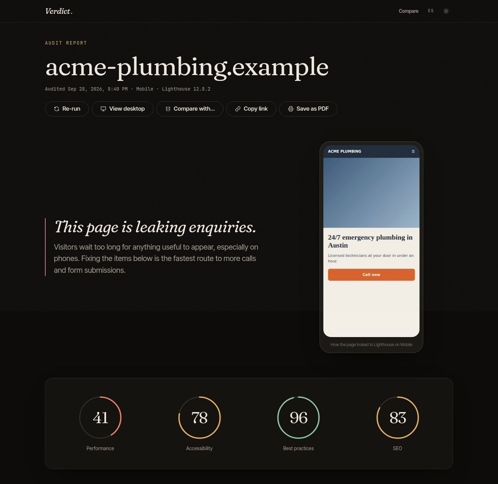
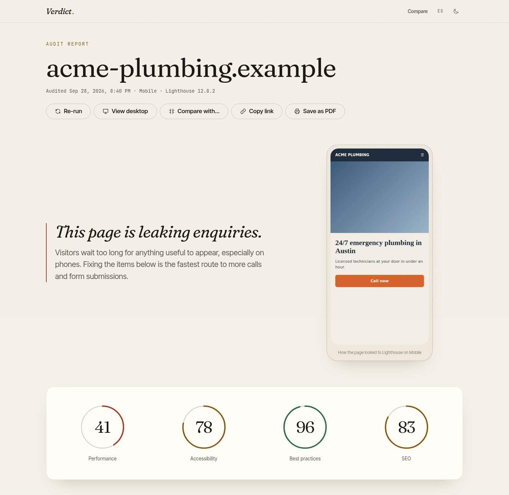
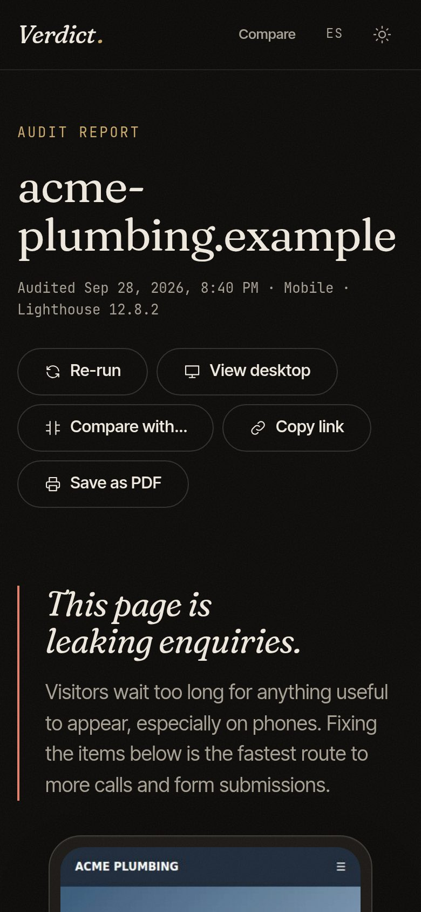

<div align="center">

# Verdict.

**Web performance audits that speak business.**

Run a Google Lighthouse audit on any website and get a verdict a business owner understands —
speed, accessibility, SEO, and a prioritized list of what to fix first.

[Live demo](https://verdict-brown-three.vercel.app) · [How it works](#architecture) · [Run it locally](#getting-started)



</div>

> Screenshots use sample data from the test fixtures (`acme-plumbing.example` is not a real site).

## Why

PageSpeed Insights gives developers a wall of numbers. The person paying for the website wants to know
one thing: _is my site losing me customers, and what do I fix first?_ Verdict answers that question
while keeping every underlying metric one click away for the developer.

## Features

- **Plain-language verdict** — real-user (Chrome UX Report) data decides the headline when Google has it; the lab score is the fallback.
- **Four Lighthouse scores** — Performance, Accessibility, Best Practices and SEO.
- **Lab vs. field metrics** — LCP, FCP, TBT, CLS, Speed Index, INP and TTFB, each plotted against Google's published thresholds with a one-line explanation of why it matters.
- **Prioritized fix list** — failing audits ranked by severity, then estimated time saved, filterable by category.
- **Head-to-head comparison** — audit your site and a competitor in parallel; lab differences under 5% count as a tie instead of a fake win.
- **Shareable, printable reports** — every report is a URL; "Save as PDF" uses a dedicated print stylesheet.
- **Bilingual (EN/ES), dark and light themes**, recent-audit history, mobile and desktop strategies.

<table>
  <tr>
    <td width="68%"></td>
    <td width="32%"></td>
  </tr>
</table>

## Tech stack

| Layer   | Choice                                        | Why                                                                                  |
| ------- | --------------------------------------------- | ------------------------------------------------------------------------------------ |
| UI      | React 19 + TypeScript (strict)                | Component model and type safety end to end, including the API contract.              |
| Build   | Vite                                          | Fast dev server; route-level code splitting out of the box.                          |
| Data    | TanStack Query                                | Caching, request de-duplication, cancellation and a deliberate retry policy.         |
| Routing | React Router                                  | URL-driven state: every report and comparison is a shareable link.                   |
| Styling | CSS Modules + design tokens                   | Zero runtime, scoped styles, one source of truth for both themes and print.          |
| API     | Vercel Function (Web `Request`/`Response`)    | Keeps the API key server-side and shrinks the payload before it reaches the browser. |
| Quality | Vitest, Testing Library, ESLint (a11y strict) | 59 tests covering parsing, the server handler and user flows; CI on every push.      |

## Architecture

```
Browser ──▶ /api/audit?url=…&strategy=…   (Vercel Function, server/handle-audit.ts)
               │  validates the URL, adds the secret key
               ▼
            Google PageSpeed Insights v5  ──▶  ~1 MB Lighthouse JSON
               │
               ▼  normalizeReport()  (src/features/audit/model/normalize.ts)
            ~35 KB AuditReport ──▶  CDN cache (s-maxage=600)  ──▶  React UI
```

**Key engineering decisions**

1. **One handler, two runtimes.** `handleAudit` speaks the Web-standard `Request → Response` API. Vercel runs it in production and a tiny Vite plugin mounts the same function in development, so there is no "works locally" drift.
2. **Normalize on the server.** The UI never touches raw Lighthouse JSON. A typed domain model (`AuditReport`) isolates the app from Lighthouse version changes, and the response shrinks by over 90% (most of what remains is the page screenshot).
3. **Defensive parsing.** Every Lighthouse field is optional in the types. Missing categories, absent field data or a malformed screenshot degrade gracefully instead of crashing — and each case has a test.
4. **Errors are part of the product.** Quota exhaustion, unreachable sites, timeouts and bad URLs map to distinct codes with human copy. Only transient failures are retried; errors are never cached.
5. **Accessibility is enforced, not hoped for.** `eslint-plugin-jsx-a11y` in strict mode, native radios behind the segmented control, focus moved to errors, `aria-live` progress during the 20–40 s audit, and `prefers-reduced-motion` respected everywhere.
6. **Performance budget.** Self-hosted variable fonts (only the axes used), route-level code splitting, a hand-picked 11-icon SVG set instead of an icon library, and immutable caching for hashed assets.
7. **Security.** The API key never ships to the client; Lighthouse descriptions are rendered as React nodes (not `innerHTML`); private and local hosts are rejected; security headers are set in `vercel.json`.

## Getting started

Requirements: Node.js 20+ and a free [PageSpeed Insights API key](https://developers.google.com/speed/docs/insights/v5/get-started).

```bash
git clone https://github.com/daniiescobar024/verdict.git
cd verdict
npm install
cp .env.example .env      # then paste your key into PSI_API_KEY
npm run dev               # http://localhost:5173
```

Without a key the app still runs, but Google's shared anonymous quota is usually exhausted.

| Script          | What it does                          |
| --------------- | ------------------------------------- |
| `npm run dev`   | Dev server with the API route mounted |
| `npm test`      | Run the test suite once               |
| `npm run check` | Typecheck + lint + tests              |
| `npm run build` | Production build to `dist/`           |

## Deploy

1. Import the repository in [Vercel](https://vercel.com/new) — the Vite preset is detected automatically.
2. Add the environment variable `PSI_API_KEY`.
3. Deploy. `api/audit.ts` becomes the serverless function; `vercel.json` handles SPA routing, caching and security headers.

## Project structure

```
api/                    Vercel Function entry point
server/                 Platform-agnostic request handler (+ tests)
src/
  app/                  Shell, providers, route table
  pages/                Home, Report, Compare, 404 (+ integration tests)
  features/audit/
    api/                Fetch client and query definitions
    model/              Domain types, normalizer, thresholds, comparison logic (+ unit tests)
    components/         Report UI: score dials, metric scales, findings, states
    hooks/              Audit history (useSyncExternalStore over localStorage)
  shared/               Design-system primitives, i18n, theme, storage helpers
  styles/               Tokens and global styles
```

## Roadmap

- Historical tracking per URL with trend charts
- Scheduled re-audits with email alerts on regressions
- Exportable, white-label PDF reports for agencies

## License

MIT © Daniel Escobar
